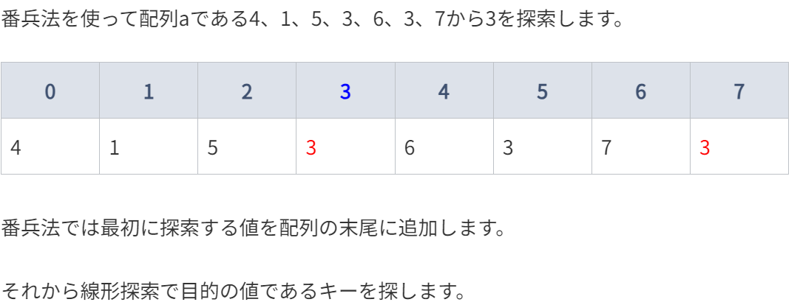
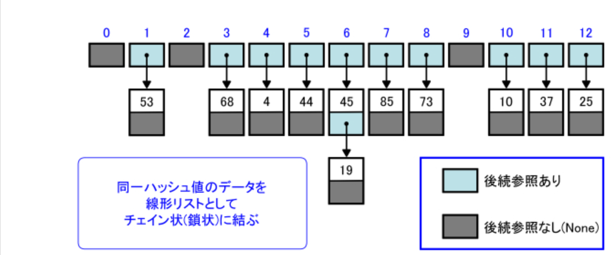

# 線形探索

直線状に並んだ配列から目的とするキーを持つ要素に出会うまで先頭から順に走査する探索方法

[線形探索のアニメーション参考](https://qiita.com/midiambear/items/f1491f1eb108af40b7ab#:~:text=%E3%83%AA%E3%82%B9%E3%83%88%E3%81%AE%E6%8E%A2%E7%B4%A2-,%E7%B7%9A%E5%BD%A2%E6%8E%A2%E7%B4%A2,-%E7%B7%9A%E5%BD%A2%E6%8E%A2%E7%B4%A2%E3%81%AF)

## 特徴

要素数が n であれば、これらの条件を判断する回数はいずれも平均 **n / 2 回**である。

## 実行コマンド

```bash
$ poetry run python3 search/linear_search.py
```

# 番兵法

配列の末尾に番兵（探索するキーと同じ値）を追加し、探索した結果が元の配列から見つかったものなのか、末尾に追加した番兵なのかを判定する探索方法



> 【Python】番兵法【アルゴリズム】
>
> *https://pawalog.com/algorithm/sentinel-method#:~:text=%E7%B5%90%E6%9E%9C(%E6%8E%A2%E7%B4%A2%E5%A4%B1%E6%95%97)-,%E7%95%AA%E5%85%B5%E6%B3%95,-%E7%B7%9A%E5%BD%A2%E6%8E%A2%E7%B4%A2%E3%81%A7%E3%81%AF*

## 特徴

番兵法は繰り返しの終了判定を削減する役割を持っている。

例えば、線形探索ではループの中で毎回配列の終端かを判定していたが、番兵法ではその必要がない。

```python
    while True:
        # 線形探索では毎回終端を判定していた
        if counter == len(number_arr):
            print(f"{key}は見つかりませんでした。")
            return

        if number_arr[counter] == key:
            print(f"{counter+1}回目のループで{key}は見つかりました。")
            return

        counter += 1
```

## 実行コマンド

```bash
$ poetry run python3 search/linear_search_for_sentinel_loop.py
```

# 2 分探索

要素がキーの昇順または降順にソートされている配列から効率よく探索を行うアルゴリズムである。

[2 分探索のアニメーション](https://qiita.com/midiambear/items/f1491f1eb108af40b7ab#%E4%BA%8C%E5%88%86%E6%8E%A2%E7%B4%A2:~:text=%E8%A1%A8%E3%81%97%E3%81%BE%E3%81%99%E3%80%82-,%E4%BA%8C%E5%88%86%E6%8E%A2%E7%B4%A2,-%E6%95%B4%E5%88%97%E3%81%95%E3%82%8C)

## 特徴

中央値の左 or 右の中央値がキーと一致するかを探索範囲がなくなるまで続ける。

繰り返しのたびに探索範囲がほぼ半分になるため、必要となる比較回数は平均**log n**である。

# 計算量

計算量は以下の２つに大別される。

- 時間計算量
  - **実行に要する時間を評価したもの**
- 領域計算量
  - **どのくらいの記憶域やファイル域が必要であるかを評価したもの**

## 線形探索の時間計算量

```python
def seq_search(a: Sequence, key: Any) -> int:
    i = 0 # step1
    while i < n: # step2
        if a[i] == key: # step3
            return i # step4
        i += 1 # step5

    return -1 # step6
```

上記の step1~6 が何回実行されるかをまとめたのが以下の通り

| step | 実行回数 | 計算量 | 説明                                                                 |
| ---- | -------- | ------ | -------------------------------------------------------------------- |
| 1    | 1        | O(1)   | 変数 i へ 0 を代入するのは 1 回限りで、データ数 n とは無関係である。 |
| 2    | n/2      | O(n)   | 配列の末尾に到達したかを判断する step2 は平均実行回数が n / 2 である |
| 3    | n/2      | O(n)   | 値との透過性を判定する step3 も平均実行回数が n / 2 である           |
| 4    | 1        | O(1)   | 関数から値を返す時のみ実行されるので O(1)                            |
| 5    | n/2      | O(n)   | 平均実行回数が n / 2 である                                          |
| 6    | 1        | O(1)   | 関数から値を返す時のみ実行されるので O(1)                            |

また、計算量最も大きい計算量に支配される。

オーダー記法については、以下の記事で分かりやすく説明されている。
https://note.com/strictlyes/n/n82d0a3874256

簡単にまとめると、、、

- O(1)
  - データ量がどんなに増えても、常に一回しか処理を行わない
- O(n)
  - データ量（n）が増えただけ、計算量も増える
- O(n^2)
  - 「^」は 2 乗なので計算量は n \* n である。多次元配列の for ループのネストなどがこれに該当する。
- O(log n)
  - データ量に対して、計算量が常に半分になっていく。O(n^2)の対極

# ハッシュ法

## ソート済み配列の操作

要素数が 10 であって、先頭の 8 個の要素にデータが昇順にソートされた状態で格納されている配列がある。

```python
a = [1,4,10,14,21,30,49,77]
```

この配列に対して 35 を追加すると以下のような操作を行うことになる。

- 挿入すべき位置を 2 分探索によって調べる
- 挿入した位置以降の全要素を一つずつ後ろへ移動する。
- 挿入すべき位置に代入する。

上記のように要素の移動に要する計算量は O(n)であるため、そのコストは決して小さいものではない。また、データ削除も同様のコストが生じる。

## ハッシュ法

データを格納すべき位置（インデックス）を単純な演算で求めることで探索だけでなく、追加・削除も効率よく良く行うのがハッシュ法である。

例えば以下の要素数 13 の配列の各要素を要素数で割った余剰を算出する。

| キー                           | 5   | 6   | 14  | 20  | 29  | 34  | 37  | 51  | 69  | 75  |
| ------------------------------ | --- | --- | --- | --- | --- | --- | --- | --- | --- | --- |
| ハッシュ値(要素数で割った余剰) | 5   | 6   | 1   | 7   | 3   | 8   | 11  | 12  | 4   | 10  |

上記で算出したハッシュ値がインデックスとなるようにキーを格納した配列がハッシュ表である。

| インデックス（ハッシュ値）     | 0   | 1   | 2   | 3   | 4   | 5   | 6   | 7   | 8   | 9   | 10  | 11  | 12  | 13  |
| ------------------------------ | --- | --- | --- | --- | --- | --- | --- | --- | --- | --- | --- | --- | --- | --- |
| ハッシュ値(要素数で割った余剰) | -   | 14  | -   | 29  | 69  | 5   | 6   | 20  | 34  | -   | 75  | 37  | 51  |

上記のハッシュ表に 35 を追加する場合に、要素を移動する必要がない

| インデックス（ハッシュ値）     | 0   | 1   | 2   | 3   | 4   | 5   | 6   | 7   | 8   | 9                                  | 10  | 11  | 12  | 13  |
| ------------------------------ | --- | --- | --- | --- | --- | --- | --- | --- | --- | ---------------------------------- | --- | --- | --- | --- |
| ハッシュ値(要素数で割った余剰) | -   | 14  | -   | 29  | 69  | 5   | 6   | 20  | 34  | <span style="color: red">35</span> | 75  | 37  | 51  |

キーからハッシュ値への変換手続きをハッシュ関数と呼ぶ。またハッシュ表の各要素のことをバケットと呼ぶ。

## 衝突とは

先ほどのハッシュ表に 18 を追加する場合、18 を 13 で割った数は 5 であるが、格納先のバケットは既に埋まっている。このようにバケットが重複する現象を衝突という。（キーとハッシュ値の対応関係が 1 対 1 である保証はないため。）

衝突が発生した場合の対処法としては以下の 2 つがある。

- チェイン法
  - 同一のハッシュ値を持つ要素を線形リストで管理する
- オープンアドレス法
  - 空きバケットを見つけるまでハッシュを繰り返す

## チェイン法



> 【Python】ハッシュ法とチェイン法【アルゴリズム】
>
> *https://pawalog.com/algorithm/hashing-chaining#:~:text=%E5%86%8D%E5%BA%A6%E8%80%83%E3%81%88%E3%81%BE%E3%81%99%E3%80%82-,%E3%83%81%E3%82%A7%E3%82%A4%E3%83%B3%E6%B3%95%E3%81%AE%E4%BB%95%E7%B5%84%E3%81%BF,-%E3%83%81%E3%82%A7%E3%82%A4%E3%83%B3%E6%B3%95%E3%81%A7%E3%81%AF*

### 探索の手続き

１．ハッシュ関数によってキーをハッシュ値に変換
２．ハッシュ値をインデックスとするバケットに着目する
３．バケットが参照する線形リストを先頭から順に探索し、キーと同じ値が見つかれば探索成功。見つからなければ失敗。
